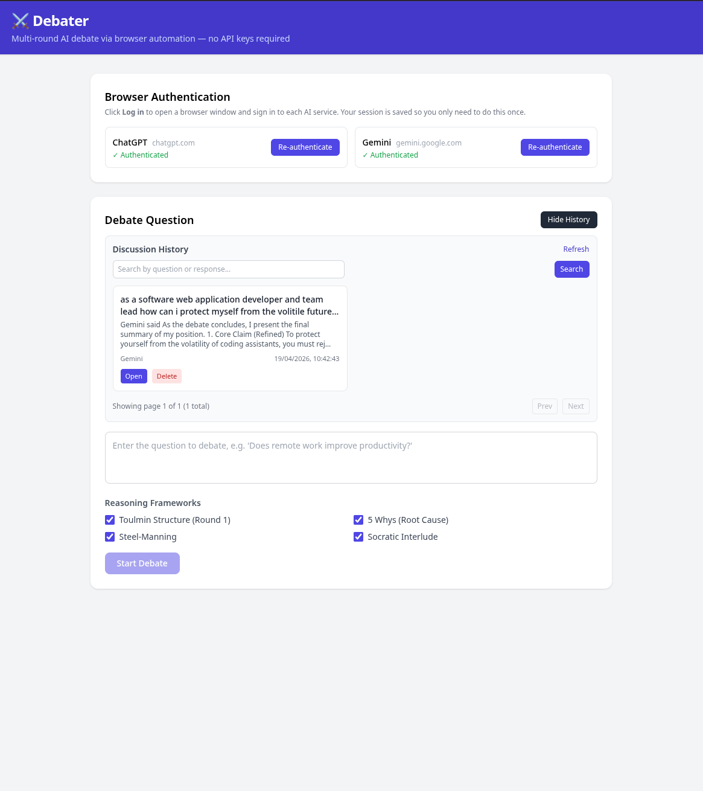

# Debater ⚔️

A multi-round AI debate orchestrator that automates the **ChatGPT** and **Gemini** web chat interfaces via [Playwright](https://playwright.dev/), orchestrates an adversarial debate between them, and applies structured reasoning frameworks to govern argument depth.

**No API keys required.** The application drives the real chat interfaces in a browser window — the same way you would use them yourself.

## UI Preview



---

## Architecture

```text
frontend (React + Vite + Tailwind)
       ↓ HTTP / SSE
backend (Node.js + TypeScript + Express)
       ↓ Playwright browser automation
     chatgpt.com     gemini.google.com
```

---

## Reasoning Frameworks

| Framework | Application |
| --------- | ----------- |
| **Toulmin Model** | Round 1 opening — Claim, Data, Warrant, Backing, Qualifier, Rebuttal |
| **5 Whys** | Counter-argument — drill to root assumptions |
| **Steel-Manning** | Every counter — state the strongest version first |
| **Socratic Interlude** | Between rounds 1 and 2 — clarifying questions |
| **Dialectical Synthesis** | Round 3 — identify genuine disagreement |

---

## Debate State Machine

```text
IDLE → ROUND_1_AI1 → ROUND_1_AI2 → SOCRATIC_INTERLUDE →
ROUND_2_AI1 → ROUND_2_AI2 → ROUND_3_AI1 → FINAL_AI1 → FINAL_AI2 → COMPLETE
```

---

## Setup

### Prerequisites

- Node.js 20+
- A free or paid account at [chatgpt.com](https://chatgpt.com) and [gemini.google.com](https://gemini.google.com)

### Install

```bash
npm install
```

Install the Playwright browser (Chromium):

```bash
cd backend && npx playwright install chromium && cd ..
```

### Configure

```bash
cp .env.example .env
# Optionally edit .env to customise auth state paths or port
```

---

## Running

### Start the app

```bash
npm run dev
```

- Frontend: <http://localhost:5173>
- Backend API: <http://localhost:3001>

### Authenticate (one-time setup)

Before running a debate, you need to log in to each AI service once:

1. Open the Debater frontend at <http://localhost:5173>
2. In the **Browser Authentication** panel, click **Log in** next to **ChatGPT**
3. A browser window opens — sign in to your ChatGPT account as normal
4. Once logged in, the window closes automatically and your session is saved
5. Repeat for **Gemini**

Your credentials are saved as browser cookies in `./auth-states/` and reused automatically on subsequent runs. The `auth-states/` directory is excluded from version control.

> **Note:** The browser runs in **visible mode** by default. This makes it easier to handle CAPTCHAs and avoids bot-detection. Set `BROWSER_HEADLESS=true` in `.env` to disable the visible window (not recommended).

---

## API

| Method | Path | Description |
|--------|------|-------------|
| GET | `/api/browser/auth/status` | Check if auth state files exist for each provider |
| POST | `/api/browser/auth/:provider` | Open browser for manual login; saves session on success |
| POST | `/api/debates` | Create a new debate session |
| GET | `/api/debates` | List all sessions |
| GET | `/api/debates/:id` | Get session details |
| POST | `/api/debates/:id/advance` | Advance one step |
| POST | `/api/debates/:id/run` | Run full debate (SSE stream or batch) |

### Create debate

```json
POST /api/debates
{
  "question": "Does remote work improve productivity?",
  "outputFormat": "stream",
  "frameworks": {
    "enableFiveWhys": true,
    "enableSteelManning": true,
    "enableSocraticInterlude": true,
    "enableToulminStructure": true
  }
}
```

---

## Important notes on browser automation

The Playwright approach is more fragile than REST APIs. Be aware:

| Risk | Mitigation |
|------|-----------|
| UI selector changes | Selectors use multiple fallbacks; update `chatgpt-browser-client.ts` / `gemini-browser-client.ts` if the UI changes |
| Bot detection | Browser runs with a realistic user agent; visible mode recommended |
| Login expiry | Re-authenticate via the frontend panel when sessions expire |
| Rate limiting | Web UI throttles differ from API quotas; add pauses if needed |
| Response timeout | Default 120s per turn; configurable in the browser client files |

---

## Testing

```bash
npm test --workspace=backend
```

## Linting

```bash
npm run lint
```

Auto-fix lint issues:

```bash
npm run lint:fix
```

Chatbot debater
